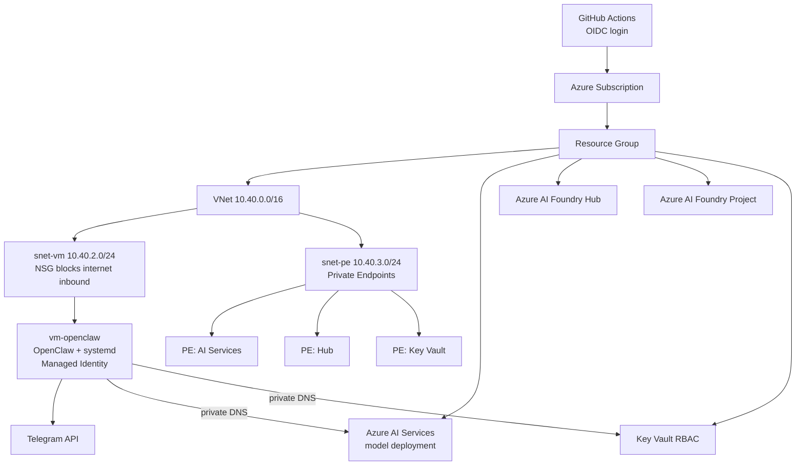

# openclaw-azure-foundry

Deploy a private OpenClaw assistant on Azure AI services, connect it to Telegram, and run it with either:

1. enterprise-style GitHub Actions CI/CD, or
2. the local CLI experience for fast onboarding.

This project is designed for teams that need strong security controls and repeatable deployment while still giving developers a fast path to adoption.

## Who This Is For

This repository is a good fit if you need:

1. No public VM endpoint.
2. No long-lived cloud credentials in GitHub.
3. Private AI and Key Vault connectivity over private endpoints.
4. A deployment path that is understandable, auditable, and easy to demo.

## Deployment Modes

You can use either path depending on audience and context:

1. DevOps mode (recommended for production): GitHub OIDC + approval gates + workflow-based deployment.
2. CLI mode (recommended for workshops and onboarding): prompt-driven terminal flow with `openclaw-azure init` and `openclaw-azure deploy`.

Use DevOps mode first when presenting architecture and governance, then show CLI mode as the productivity accelerator.

## What This Project Deploys

At a high level, one deployment creates:

1. A resource group.
2. A virtual network with a private VM subnet and private endpoint subnet.
3. An Azure AI Services account with model deployment.
4. Azure AI Foundry Hub and Project resources.
5. A private Key Vault with secrets.
6. A Linux VM with OpenClaw installed and managed by systemd.
7. Private endpoints and private DNS zone links for AI and Key Vault.

## End-to-End Outcome

When deployment is successful, you should have:

1. A running OpenClaw gateway service on a private VM.
2. Telegram channel connectivity through your bot token.
3. Azure AI model calls routed privately from VM to AI services.
4. Secrets resolved from Key Vault using VM managed identity.
5. A repeatable infra deployment story you can re-run safely.

## Architecture



## Repository Layout

- [infrastructure/main.bicep](infrastructure/main.bicep): Root subscription-scope deployment.
- [infrastructure/modules](infrastructure/modules): Networking, compute, AI services/foundry, key vault, private endpoints.
- [infrastructure/cloud-init/cloud-init.yaml](infrastructure/cloud-init/cloud-init.yaml): VM bootstrap and OpenClaw configuration.
- [infrastructure/parameters](infrastructure/parameters): Environment parameter files.
- [openclaw-config](openclaw-config): Runtime OpenClaw config templates pushed by workflow.
- [.github/workflows](.github/workflows): Validate, infra deploy, and config update pipelines.
- [scripts](scripts): Operational helpers for connect/validate/teardown.
- [docs](docs): Setup, architecture, and troubleshooting details.

## Project Modes in Detail

### Mode A: GitHub DevOps Deployment

Best when you need:

1. approvals and gates,
2. reviewable workflow logs,
3. environment governance.

Primary workflow files:

1. [.github/workflows/validate.yml](.github/workflows/validate.yml)
2. [.github/workflows/infra-deploy.yml](.github/workflows/infra-deploy.yml)
3. [.github/workflows/openclaw-config.yml](.github/workflows/openclaw-config.yml)

### Mode B: Local CLI Deployment

Best when you need:

1. workshop/demo speed,
2. easier first-time setup,
3. no repository forking requirement.

CLI package location:

1. [cli](cli)

CLI commands currently included:

1. `openclaw-azure init`
2. `openclaw-azure deploy`

## Before You Start

## Prerequisites

1. Azure subscription where you can deploy at subscription scope.
2. GitHub repository with Actions enabled.
3. Azure CLI installed and logged in.
4. Telegram bot token from BotFather.
5. SSH keypair for VM access.
6. Node.js + npm if using CLI mode.

### Tooling Quick Checks

Run these before deployment day:

```bash
az --version
az account show -o table
node --version
npm --version
gh auth status
```

Suggested key generation:

```bash
ssh-keygen -t ed25519 -C "openclaw"
```

## Required Azure Permissions

For the identity used by GitHub Actions, assign at least:

1. Contributor on subscription (resource deployments).
2. User Access Administrator on subscription (RBAC assignment for VM managed identity to Key Vault).

## Naming and Resource Constraints

Pay attention to resource naming constraints, especially for:

1. Storage account (`3-24`, lowercase letters and numbers only).
2. Key Vault (`3-24`, lowercase letters, numbers, dashes).
3. AI services account and DNS-safe names.

If names are not valid, deployment validation can fail early.

## End-to-End Setup (Correct Order)

Follow these steps in order. This is the fastest path for a first successful CI/CD deployment.

### Step 1: Fork or Clone

```bash
git clone https://github.com/YOUR_ORG/openclaw-azure-foundry.git
cd openclaw-azure-foundry
```

If you are presenting, create a dedicated demo branch and keep your production branch untouched.

### Step 2: Configure OIDC from GitHub to Azure

Use the sequence in [docs/SETUP.md](docs/SETUP.md) to:

1. Create Entra App Registration for CI/CD.
2. Create service principal.
3. Add federated credentials for main and pull request runs.
4. Assign Azure roles.

OIDC removes the need for stored service-principal secrets.

For a click-by-click automation path (including optional SSH key generation in workflow), use [docs/BOOTSTRAP-CHECKLIST.md](docs/BOOTSTRAP-CHECKLIST.md).

Important:

1. Ensure federated credentials include the branch/event patterns you actually use.
2. Ensure role assignments are at the correct subscription scope.
3. Allow time for RBAC propagation before first deployment.

### Step 3: Configure GitHub Secrets and Variables

Set these in GitHub repository settings.

Secrets:

| Name | Value |
|------|-------|
| SSH_PUBLIC_KEY | Contents of your public key file |
| TELEGRAM_BOT_TOKEN | BotFather token |

Variables:

| Name | Value |
|------|-------|
| AZURE_CLIENT_ID | App registration client ID |
| AZURE_TENANT_ID | Entra tenant ID |
| AZURE_SUBSCRIPTION_ID | Target subscription ID |

Double-check names exactly. Workflow variable/secret typos are one of the most common failures.

### Step 4: Create GitHub Environment Gate

Create environment prod in GitHub and add required reviewers.

This enables the deployment approval gate used by infra pipeline.

Recommended gate settings:

1. Required reviewers enabled.
2. Prevent self-approval for production where required by policy.

### Step 5: Review Parameter File

Check [infrastructure/parameters/prod.bicepparam](infrastructure/parameters/prod.bicepparam):

1. Naming values are globally unique where required.
2. Region and VM size fit your needs.
3. Model and capacity settings are appropriate.

File to review:

1. [infrastructure/parameters/prod.bicepparam](infrastructure/parameters/prod.bicepparam)

### Step 6: Push to Main

```bash
git push origin main
```

This triggers infra CI/CD.

## Detailed DevOps Path (Walkthrough)

### Phase 1: Validate

The validate workflow checks:

1. Bicep compile/lint consistency.
2. Deployment validation against Azure.
3. Shell script linting.

If validate fails, fix before continuing.

### Phase 2: What-If

The infra workflow runs what-if first and previews planned changes.

Use this stage to catch naming, policy, and parameter issues early.

### Phase 3: Approval Gate

Deployment pauses at `prod` environment gate.

Approve only after reviewing what-if output.

### Phase 4: Deploy

Resources are created/updated from [infrastructure/main.bicep](infrastructure/main.bicep).

### Phase 5: Verify

Workflow verify step checks service state on VM.

Then run local validation script to confirm runtime state.

## CI/CD Flow

### Validate Workflow

File: [validate.yml](.github/workflows/validate.yml)

Runs on pull requests and performs:

1. Bicep compilation/lint check.
2. ARM validation command.
3. Shell script linting.

Reference file:

1. [.github/workflows/validate.yml](.github/workflows/validate.yml)

### Infrastructure Deployment Workflow

File: [infra-deploy.yml](.github/workflows/infra-deploy.yml)

Runs on main for infrastructure changes and does:

1. What-if preview.
2. Deployment after prod approval.
3. Post-deploy VM verification.

Reference file:

1. [.github/workflows/infra-deploy.yml](.github/workflows/infra-deploy.yml)

### OpenClaw Config Workflow

File: [openclaw-config.yml](.github/workflows/openclaw-config.yml)

Runs on config changes and does:

1. Resolve latest deployed RG/VM/Key Vault.
2. Render config templates.
3. Pull secrets from Key Vault on VM via managed identity.
4. Apply config and restart OpenClaw.

Reference file:

1. [.github/workflows/openclaw-config.yml](.github/workflows/openclaw-config.yml)

## CLI Mode (Detailed)

The CLI mode is useful for demos and fast setup.

### Install and Build CLI

```bash
cd cli
npm install
npm run build
```

Optional global install:

```bash
npm install -g ./cli
openclaw-azure help
```

### Initialize CLI Config

```bash
openclaw-azure init
```

This generates:

1. `.openclaw-azure/config.json`
2. `.openclaw-azure/generated.bicepparam`

### Deploy from CLI

```bash
openclaw-azure deploy
```

The CLI will:

1. Run preflight checks for Azure CLI/account/bicep.
2. Prompt for Telegram token at runtime.
3. Execute subscription-scope deployment.

Note:

1. Telegram token is not persisted in local config.

## First Deployment Verification

After deployment succeeds, verify in this order.

### 1) Check Workflow Status

Confirm successful runs for:

1. Deploy Infrastructure.
2. Verify OpenClaw Status.

### 2) Validate VM and Service

```bash
./scripts/validate-deployment.sh
```

If script fails, immediately inspect:

1. workflow logs,
2. cloud-init output,
3. OpenClaw service logs.

### 3) Connect to VM

```bash
az extension add -n ssh
./scripts/connect.sh
```

### 4) Check Service Health Logs

```bash
sudo systemctl status openclaw
sudo journalctl -u openclaw -n 100 --no-pager
```

You can also tail logs live:

```bash
sudo journalctl -u openclaw -f
```

### 5) Test Telegram

1. Send start or hello to your bot.
2. Confirm the bot responds.
3. If no response, inspect [docs/TROUBLESHOOTING.md](docs/TROUBLESHOOTING.md).

## Post-Deployment Checklist

Use this checklist before declaring success:

1. Infra workflow green on validate/what-if/deploy/verify.
2. VM service healthy under systemd.
3. Private DNS resolution returns private addresses for AI and Key Vault endpoints.
4. Telegram message receives model-generated response.
5. No plaintext secrets committed to git status.

## Operational Model

Use this workflow after first success:

1. Infrastructure edits go through pull request, then merge to main.
2. Runtime config edits go in [openclaw-config](openclaw-config), then merge to main.
3. Never store API keys in repository files.
4. Use Key Vault as source of truth for secrets.

## Day-2 Operations

Common day-2 tasks:

1. Rotate Telegram token in Key Vault.
2. Rotate model key in Key Vault.
3. Update runtime config through repo workflow.
4. Validate service health after each change.

Helpful commands:

```bash
./scripts/validate-deployment.sh
./scripts/connect.sh
```

## Security Design Highlights

1. VM has no public IP.
2. NSG denies inbound from internet.
3. Azure AI and Key Vault public access are disabled.
4. VM uses managed identity to retrieve secrets.
5. GitHub Actions authenticates with OIDC, not client secret.

Additional good practices:

1. Restrict who can approve production environment deployments.
2. Enable budget alerts and activity monitoring in Azure subscription.
3. Keep least privilege assignments for automation identities.

## Cost Guidance

Your cost depends mostly on:

1. VM SKU and uptime.
2. Azure AI model usage and capacity.
3. Private endpoint count.

Use Azure Cost Management and set budgets/alerts early.

For live demos, consider low-cost temporary naming profiles and teardown immediately after session.

## Common Pitfalls

1. Missing GitHub environment approval blocks deployment.
2. Wrong secret/variable names in repository settings.
3. Non-unique Azure resource names in parameter file.
4. Config drift when changing runtime manually on VM and not committing templates.
5. DNS/endpoint mismatch leading to model-not-found or 404 errors.
6. Wrong active GitHub account causing push/auth confusion.
7. Wrong active Azure subscription during deployment.

Use [docs/TROUBLESHOOTING.md](docs/TROUBLESHOOTING.md) for incident-oriented diagnostics.

## Troubleshooting Quick Map

If issue is about:

1. Login/auth -> check `az account show` and `gh auth status`.
2. Deployment failure -> inspect workflow run logs and what-if output.
3. VM runtime -> inspect systemd + journal logs.
4. Telegram no response -> validate token + bot state + OpenClaw logs.
5. AI model errors -> validate endpoint DNS/path and deployment model name.

## Cleanup

```bash
./scripts/teardown.sh
```

or

```bash
az group delete --name rg-openclaw --yes --no-wait
```

For demo environments, always run cleanup to avoid orphaned spend.

## Additional Documentation

- [docs/SETUP.md](docs/SETUP.md): Detailed command-level setup.
- [docs/ARCHITECTURE.md](docs/ARCHITECTURE.md): Deep architectural rationale.
- [docs/TROUBLESHOOTING.md](docs/TROUBLESHOOTING.md): Failure patterns and fixes.

## Presentation Assets

For conference/workshop delivery:

1. [docs/presentation/SESSION-AGENDA-60MIN.md](docs/presentation/SESSION-AGENDA-60MIN.md)
2. [docs/presentation/SLIDE-CONTENT-OUTLINE.md](docs/presentation/SLIDE-CONTENT-OUTLINE.md)
3. [docs/presentation/DEMO-RUNBOOK.md](docs/presentation/DEMO-RUNBOOK.md)
4. [docs/presentation/SPEAKER-SCRIPT.md](docs/presentation/SPEAKER-SCRIPT.md)

## FAQ

### Do I have to use GitHub CI/CD?

No. You can use CLI mode for a faster operator experience, especially for demos and workshops.

### Is the VM publicly exposed?

No. VM is private and intended to be accessed through Azure tools and internal networking controls.

### Where are secrets stored?

In Azure Key Vault. Runtime retrieves secrets through managed identity.

### Can I customize model and capacity?

Yes. Adjust model fields in parameter inputs and rerun deployment flow.

### What should I demo first to an audience?

Show DevOps backbone first for credibility, then CLI flow for excitement and adoption.

## Contributing

Contributions are welcome. Please open an issue first for significant changes and ensure workflows pass before submitting a pull request.

## License

MIT. See [LICENSE](LICENSE).
